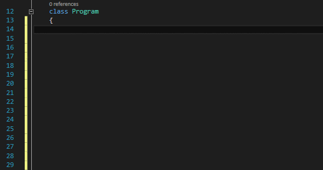

# C# Code Region Snippets (vs2013, vs2015)

<!-- Update the VS Gallery link after you upload the VSIX-->
Download this extension from the [VS Gallery](https://marketplace.visualstudio.com/vsgallery/26e59a14-f92c-40b1-8dc8-a62b3f55e68a)
or get the [CI build](http://vsixgallery.com/extension/BE701C9A-FDDD-44C9-AAA9-69B441577417/).

---------------------------------------

The easiest way to add Code Regions with same name at region start and region end to `C#` code in vs2013, vs2015.

See the [change log](CHANGELOG.md) for changes and road map.

## Features

- **Code region snippet with custom name**
- **Code region snippet with fixed name**
- **Fixed set of code regions snippet** 

**Code regions snippets invoking options:**

1. By shortcut `Ctrl+k, Ctrl+s`.

    1.1. Select code that should be surrounded with region (or just put the cursor in some place) and type `Ctrl+k, Ctrl+s`.
    
    

	1.2. Click on *Regions* folder.

	

2. By snippet hotkey.
	
	2.1. By typing a `#r` on an empty line, a list of snippets appears. Hit `Tab` twice on the snippet you want and it will be inserted.

	

### Code region snippet with custom name
Surrounds the code with regions marks when the same region name appeares in both marks

### Code region snippet with fixed name
Surrounds code with regions marks when the region name is predefined for:
  - `Events`
  - `Fields`
  - `Properties`
  - `Constructors`
  - `Methods`

### Fixed set of code regions snippet
Adds predefined set of regions for:
  - `Class`
  - `Interface`

## Contribute
Check out the [contribution guidelines](CONTRIBUTING.md)
if you want to contribute to this project.

For cloning and building this project yourself, make sure
to install the
[Code Regions Snippets](https://marketplace.visualstudio.com/items?itemName=YurS.CodeRegionSnippets)
extension for Visual Studio which enables some features
used by this project.

## License
[Apache 2.0](LICENSE)